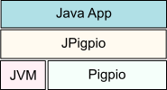
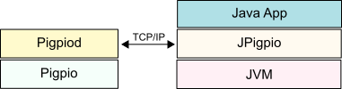

# jpigpio
A Java interface to the Raspberry Pi pigpio library

[Pigpio](http://abyz.co.uk/rpi/pigpio/index.html) is a great library for accessing the GPIO pins and other inputs and outputs of a Raspberry Pi.  Pigpio provides interfaces for C and Python.  However, if what you want to do is use the functions of the library from a Java application, you are stuck.  The purpose of this project is to provide a Java interface to the pigpio library.

The core of the solution is a Java interface called `jpigpio.JPigpio`.  It is this interface that provides the exposed functions that perform the pigpio requests.  Currently, the following pigpio operations are supported:

* gpioInitialize
* gpioTerminate
* gpioGetMode
* gpioSetMode
* gpioRead
* gpioWrite
* gpioSetAlertFunc
* gpioSetPullUpDown
* gpioDelay
* gpioTick

* gpioServo

* i2cOpen
* i2cClose
* i2cReadDevice
* i2cWriteDevice

Obviously, this is only a subset of the full and rich capabilities of C and Python pigpio.  However, the subset is the starter set we chose to create.  If you find you need a pigpio function that is not provided by Java, simply let us know and we will turn it around very quickly.  We simply don't want to spend time porting if there is no demand.

Since `jpigpio.JPigpio` is a Java interface, something must implement it.  Two separate implementations are provided.  One called `jpigpio.Pigpio` and one called `jpigpio.PigpioSocket`.  Both of them implement the `jpigpio.JPigpio` interface.  The difference between them is how the calls from Java to pigpio are achieved.

## jpigpio.Pigpio
Using this class, your custom Java code **must** be executed on the Raspberry Pi.  The method calls made in Java are passed as quickly as possible to the underlying pigpio C library for execution.  This provides the fastest capability to call pigpio with as little Java overhead as possible.  Of course, the Java classes must execute on the Pi.

  

## jpigpio.PigpioSocket
Using this class, your custom Java code can run either on the Raspberry Pi or on a separate machine as long as there is a network connection (TCP/IP).  The pigpio function requests are transmitted via sockets to the pigpio supplied demon which is called `pigpiod` which can listen for incoming requests and service them when they arrive.

  

## Exception handling
The pigpio library returns code values which indicate the outcome of a function call.  In Java, we have the ability to throw exceptions.  As such, if an error is detected when making a jpigpio method call, an exception of type `PigpioException` is thrown.  This makes our logic for error handling much cleaner as we do not have to explicitly check the response values for each of the calls.

Upon catching a PigpioException, we can ask for the error code value with the `getErrorCode()` method.

Symbolic definitions for each of the potential errors are supplied as statics on the PigpioException class.  For example:

     PigpioException.PI_BAD_GPIO

will have a value of `-3` which is the underlying code for the corresponding pigpio error.

    try {
    	// Perform a pigpio function
    }
    catch(PigpioException e) {
    	e.printStackTrace();
    	if (e.getErrorCode() == PigpioException.PI_BAD_GPIO) {
    		System.out.println("You supplied a bad pin!");
    	}
    }

----

# Installation
A prerequisite of this package is the correct installation of pigpio by itself.  Please see the Pigpio [Download & Install](http://abyz.co.uk/rpi/pigpio/download.html) page for details.

Details of the installation techniques to be provided here ...

----

# Future of the project
I will be delighted to accept change requests and bug reports (if any can be found) and turn those around as quickly as possible.  I have been an IT hobbyist/coder for decades and am not planning on going anywhere soon so feel free to believe that this will be a maintained project as long as needed.